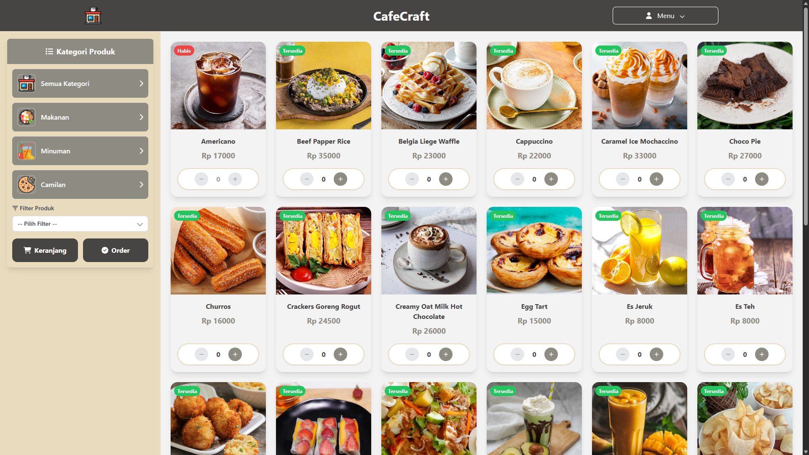

<h1 align="center">🛍️ Self Order (Silverstripe CMS)</h1>

<p align="center">
  
</p>

<h4 align="center">
Platform e-commerce sederhana berbasis <a href="https://www.silverstripe.org/" target="_blank">Silverstripe CMS</a> dengan integrasi <a href="https://duitku.com/" target="_blank">Duitku API</a> untuk pembayaran otomatis.
</h4>

<p align="center">
	
	
	
	
</p>

<p align="center">
  <a href="#tentang">Tentang</a> •
  <a href="#fitur">Fitur</a> •
  <a href="#instalasi">Instalasi</a> •
  <a href="#ngrok">Ngrok</a> •
  <a href="#struktur">Struktur</a> •
  <a href="#tools">Tools</a> •
  <a href="#kontribusi">Kontribusi</a> •
  <a href="#lisensi">Lisensi</a>
</p>

---

<h2 id="tentang">📖 Tentang</h2>

Self Order adalah platform pemesanan mandiri berbasis Silverstripe CMS yang memungkinkan pelanggan melakukan pemesanan, pembayaran, dan menerima invoice otomatis melalui email.  
Aplikasi ini cocok untuk restoran, kafe, atau toko kecil yang ingin sistem pemesanan digital tanpa biaya bulanan tinggi.

---

<h2 id="fitur">🚀 Fitur Utama</h2>

- 🔐 Login dengan Google Auth  
- 🛒 Manajemen produk & kategori  
- 💳 Pembayaran otomatis (Duitku Sandbox)  
- 📊 Dashboard admin (CMS)  
- 🧾 Invoice PDF & Email  
- 🌐 Dukungan URL Ngrok untuk webhook & testing publik  

---

<h2 id="instalasi">📦 Langkah Instalasi</h2>

### 1️⃣ Clone Repository
```bash
git clone https://github.com/IkhwanVanno/SelfOrder-Silverstripe.git
cd namaproject
````

### 2️⃣ Salin dan Atur File `.env`

```dotenv
# Environment
SS_ENVIRONMENT_TYPE="dev"
SS_BASE_URL="http://localhost/namaproject"

# Database
SS_DATABASE_CLASS="MySQLDatabase"
SS_DATABASE_SERVER="127.0.0.1"
SS_DATABASE_NAME="namadatabase"
SS_DATABASE_USERNAME="root"
SS_DATABASE_PASSWORD=""

# Admin Login
SS_DEFAULT_ADMIN_USERNAME="admin"
SS_DEFAULT_ADMIN_PASSWORD="password"

# Mailer
MAILER_DSN=""

# Google OAuth
GOOGLE_CLIENT_ID=""
GOOGLE_CLIENT_SECRET=""

# Duitku (Sandbox)
DUITKU_MERCHANT_CODE=
DUITKU_API_KEY=
DUITKU_GETPAYMENTMETHOD_URL=
DUITKU_BASE_URL=

# Ngrok
NGROK_URL=https://ngrok_url/MetroShoppingG

# Proxy Fix
SS_TRUSTED_PROXY_IPS="*"
SS_TRUSTED_PROXY_PROTOCOL_HEADER="X-Forwarded-Proto"
SS_TRUSTED_PROXY_HOST_HEADER="X-Forwarded-Host"
```

> 📝 **Catatan:** Ganti `namaproject`, `namadatabase`, dan `NGROK_URL` sesuai kebutuhan.

---

### 3️⃣ Instalasi Dependensi

```bash
composer install
composer update
composer vendor-expose
composer require dompdf/dompdf
```

---

### 4️⃣ Setup Database

Buka di browser:

```
http://localhost/namaproject/dev/build
```

---

### 5️⃣ Login ke Admin Panel

```
http://localhost/namaproject/admin
```

Gunakan akun default:

```
Username: admin
Password: password
```

---

<h2 id="ngrok">🌐 Ngrok (Testing URL Publik)</h2>

Untuk menjalankan webhook atau testing online:

```bash
ngrok http 80
```

Kemudian ganti `SS_BASE_URL` dan `NGROK_URL` di file `.env` dengan URL hasil dari Ngrok.

---

<h2 id="struktur">🧩 Struktur Umum Silverstripe</h2>

| Folder/File     | Deskripsi                                  |
| --------------- | ------------------------------------------ |
| `app/`          | Kode kustom (controller, model, template)  |
| `public/`       | Folder web root (`index.php`, file publik) |
| `.env`          | Konfigurasi environment & API              |
| `composer.json` | Dependensi proyek                          |

---

<h2 id="tools">🛠️ Tools yang Digunakan</h2>

* [Silverstripe CMS](https://www.silverstripe.org/)
* [Duitku Sandbox](https://docs.duitku.com/)
* [Ngrok](https://ngrok.com/)
* [Dompdf](https://github.com/dompdf/dompdf)

---

<h2 id="kontribusi">🤝 Kontribusi</h2>

Kontribusi sangat dihargai!
Pastikan untuk melakukan langkah berikut sebelum membuat Pull Request:

* Jalankan `composer lint`
* Uji fitur sebelum mengajukan PR
* Tambahkan deskripsi perubahan secara jelas

---

<h2 id="lisensi">📄 Lisensi</h2>

Project ini menggunakan lisensi **[BSD-3-Clause License](LICENSE)**.

---

**<p align="center">Made with ❤️ by Ikhwan Vanno Handoyo</p>**

```

---

### 📌 Keterangan:
- Gambar preview diambil dari file `preview.png` yang kamu letakkan **di luar folder proyek tapi masih dalam repo**  
  → Contoh struktur:
```

.
├── preview.png
├── public/
├── app/
├── composer.json
└── README.md